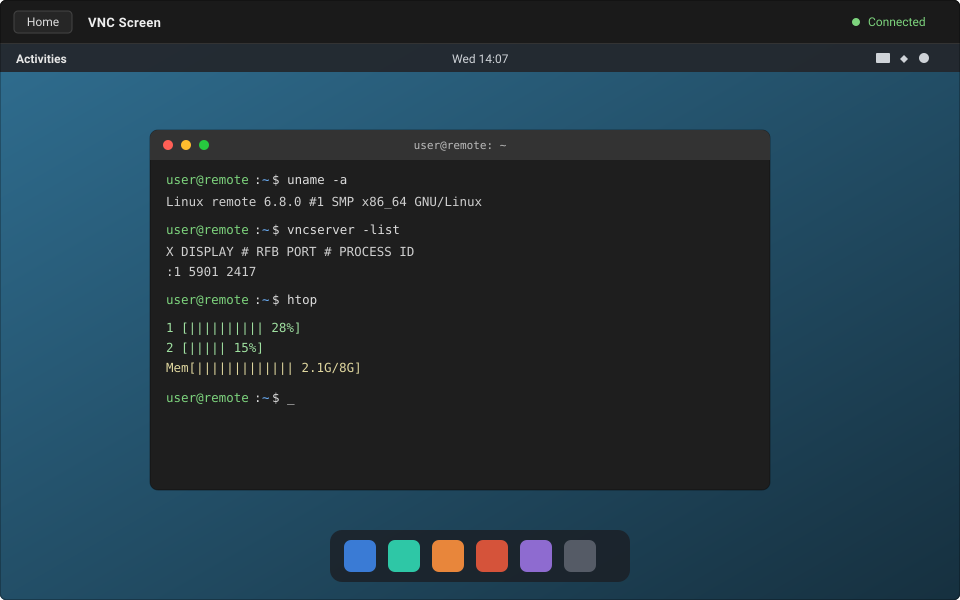

# novnc-wla

TypeScript web client that renders a VNC session with [`@novnc/novnc`](https://github.com/novnc/noVNC).
Webpack bundles everything into a single JS file plus an `index.html`.



## Install

```sh
npm install
```

## Build

```sh
# Endpoint = same origin, "/" path (default is 0:0:0:0)
npm run build

# Endpoint fixed at build time — spec forms below — any of:
npm run build --endpoint=0:0:0:0:5900/websockify
npm run build -- --env endpoint=/websockify
VNC_ENDPOINT=wss://vnc.example.com/websockify npm run build

# Serve the app under a sub-path — assets, index.html <script>/<link> hrefs,
# and manifest.json all move to <base-url>/* — any of:
npm run build --base-url=/vnc/
npm run build -- --env baseUrl=/vnc/
BASE_URL=/vnc/ npm run build
```

`--base-url` only affects where the static files are served from (and makes the
header's **Home** button → `/` appear; hidden when the base URL is `/`). It does
**not** affect the WebSocket endpoint — use `--endpoint` for that.

Output goes to `dist/`:

- `index.html` + `novnc-wla.<hash>.js` (+ `.map`)
- `favicon.svg`
- `manifest.json` — describes the bundle for a host launcher (name, version,
  entry, icons, and every emitted file with its URL and MIME type)

Serve that directory with any static web server, behind a WebSocket-to-VNC proxy
such as [websockify](https://github.com/novnc/websockify).

## Dev server

```sh
npm start          # http://localhost:8080
```

## Endpoint resolution

The page scheme always decides `ws` vs `wss` (`http` → `ws`, `https` → `wss`).
`--endpoint` only supplies host / port / path. A missing port is taken from the
page (its explicit port, else `80` for `ws` / `443` for `wss`).

| `--endpoint` | Page `http://192.168.1.1/123` | Page `https://192.168.1.1` |
| ------------ | ----------------------------- | -------------------------- |
| *(unset)* — same as `0:0:0:0` | `ws://192.168.1.1:80/`         | `wss://192.168.1.1:443/`    |
| `0:0:0:0` / `0.0.0.0` — same as `/` | `ws://192.168.1.1:80/`  | `wss://192.168.1.1:443/`   |
| `0.0.0.0/123` — same as `/123` | `ws://192.168.1.1:80/123`    | `wss://192.168.1.1:443/123` |
| `0:0:0:0:4444/vnc`            | `ws://192.168.1.1:4444/vnc`   | `wss://192.168.1.1:4444/vnc` |
| `/vnc` (absolute path)       | `ws://192.168.1.1:80/vnc`     | `wss://192.168.1.1:443/vnc` |
| `vnc` (relative to page dir) | `ws://192.168.1.1:80/123/vnc` | `wss://192.168.1.1:443/vnc` |
| `wss://host/x` / `https://host/x` | used as-is (`https` → `wss`); host `0.0.0.0` / port `0` fall back to the origin | |

Host `0.0.0.0` (or `0:0:0:0`) always means "the origin host"; likewise an
omitted port means "the origin port".

## Runtime query parameters

| Param      | Effect                                     |
| ---------- | ---------------------------------------- |
| `path`     | Overrides the resolved WebSocket path     |
| `password` | VNC password                             |
| `username` | VNC username (RFB `credentials.username`) |

## Layout

| File                   | Purpose                                        |
| ---------------------- | --------------------------------------------- |
| `src/index.ts`         | Entry point; wires up the `RFB` connection     |
| `src/endpoint.ts`      | `--endpoint` spec parsing / WebSocket URL resolution |
| `src/index.html`       | Page shell (`#screen` container, status bar)   |
| `src/types/novnc.d.ts` | Local typings for `@novnc/novnc`               |
| `tools/manifest-plugin.js` | Webpack plugin that emits `dist/manifest.json` |
| `webpack.config.js`    | Bundle config + `DefinePlugin` endpoint inject |
